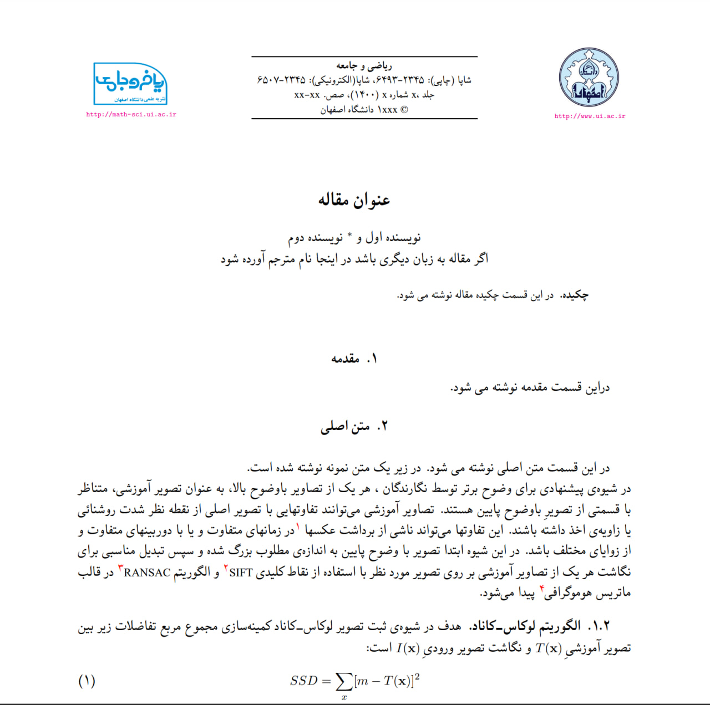

# LaTeX Template for the Journal of Mathematics and Society

The **Journal of Mathematics and Society** is dedicated to publishing research in the field of mathematical sciences. Its primary objectives are to promote the popularization of mathematics, familiarize the public with the history and philosophy of mathematics, and expand the knowledge of its applications. The journal covers a wide range of topics within mathematical sciences and related disciplines, such as the history and philosophy of science. It is published in **Persian**.



[Visit the Journal Website](https://math-sci.ui.ac.ir/?lang=en)

## Setup Instructions

### 1. **Install Fonts**

To use the template, you need to install the required fonts. You can do this by:

- Right-clicking the font files in the `fonts/` directory.
- Selecting **Install for all users**.
- Confirm installation by checking the `C:\Windows\Fonts` directory.

### 2. **Cache Fonts**

After installing the fonts, you may need to rebuild the font cache. Use the following command to do so:

```bash
fc-cache -fv
```

### 3. **Confirm Font Installation**

To verify that the fonts are correctly installed, run one of the following commands:

```bash
fc-list | findstr "Niloofar"
```

or (on Linux/macOS):

```bash
fc-list | grep "XB Niloofar"
```

### 4. **Build the PDF**

Once everything is set up, you can compile the LaTeX template into a PDF using the following command:

```bash
xelatex "Style File.tex"
```

### License

The journal's audience includes the general public, making it an ideal platform for achieving its goal of disseminating mathematical knowledge. The journal will now accept a variety of scientific articles, including:

- Research Articles
- Promotional Pieces
- Review Papers
- Short Communications
- Applied Mathematics
- Translations
- Opinion Pieces

Copyright 2024, The Journal of Mathematics and Society
